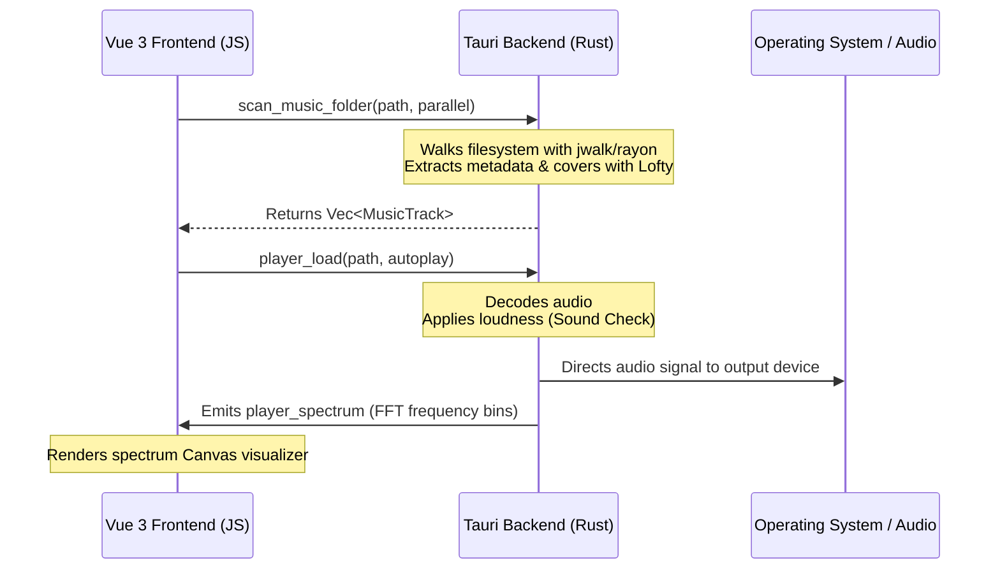

<div align="center">

# Ts-Music

*A high-performance, native desktop music player built with Tauri 2, Vue 3, and Rust.*

[](https://tauri.app/)
[](https://vuejs.org/)
[](https://www.rust-lang.org/)
[](https://vitejs.dev/)
[](https://tailwindcss.com/)

</div>

---

## Overview

Ts-Music is a lightweight, cross-platform desktop music player designed for audiophiles who prefer local libraries. It is architected with a clean separation of concerns:
* **The Rust Backend (Tauri)** performs CPU-heavy file indexing, high-speed directory traversal, metadata extraction, audio decoding/processing, and integration with the host operating system.
* **The Vue 3 Frontend (Vite)** delivers a visually stunning, responsive user interface with rich animations, smooth transitions, and premium glassmorphic dark-mode aesthetics.

By shifting resource-intensive operations to native code, Ts-Music scans tens of thousands of local files in seconds while maintaining a low memory footprint and fluid UI responsiveness.

---

## Core Features

### Native Rust Audio Engine & Backend
* **High-Speed Directory Scanner:** Walks directories using Rayon for multi-threaded processing and jwalk for parallel traversal.
* **Robust Metadata Parsing:** Extracts titles, artists, albums, years, track numbers, and embedded cover art across diverse audio formats using Lofty-rs.
* **Smart Disk Invalidation Cache:** Caches downscaled covers as JPEG thumbnails. Thumbnails are automatically invalidated and updated if the file modification time (`mtime`) or size changes.
* **Live FFT Spectrum Visualizer:** Processes audio frequencies in real-time on the Rust backend and sends spectrum data to the frontend for dynamic rendering.
* **Crossfade & Gapless Playback:** Pre-decodes upcoming tracks to support seamless gapless transitions or overlaps them with configurable crossfade times.
* **Volume Normalization (Sound Check):** Normalizes track volume using ReplayGain tags, falling back to a background EBU R128 loudness analysis.
* **System Media Transport Controls (SMTC):** Integrates with native Windows/Mac/Linux media overlays, taskbar thumbnails, and keyboard media keys (Play/Pause, Next, Prev).
* **Output Device Selector:** List and route audio output directly to specific system-level hardware.
* **Dynamic File Watcher:** Automatically monitors scanned directories for additions, deletions, or modifications to auto-refresh the library on disk changes.

### Premium Frontend Experience (Vue 3)
* **Glassmorphic UI Design:** A beautiful dark-theme interface with custom scrollbars, animated transitions, and responsive side rails that collapse on compact window widths.
* **Apple Music-Style Fullscreen Player:** Immersive Now Playing overlay featuring a blurred cover art background, real-time scrolling lyrics sync, volume controls, and track seek bars.
* **Synchronized Lyrics Search Chain:** Automatically fetches lyrics by querying LRCLIB, embedded metadata tags, NetEase, and Musixmatch (with optional community token configuration). Supports Romaji romanization toggles.
* **Smart Recommendations Widget:** Suggests recommended tracks for new or empty playlists, allowing users to instantly quick-add songs. Automatically hides when the playlist reaches 6 tracks.
* **FLIP Reordering Animations:** Drag-and-drop to reorder songs in playlists, likes, or the up-next queue with fluid layout transitions.
* **Global Context Menus:** Right-click context actions on any song to control queues, manage playlists, open file locations, or delete files from the disk.
* **Title Bar Integration:** Custom frameless HTML title bar supporting window dragging, native maximizes, window buttons, and Vue Router back/forward page transitions.

---

## Supported Formats

| Category | Extensions |
|---|---|
| **Lossy Audio** | `.mp3` · `.m4a` · `.aac` · `.ogg` · `.opus` |
| **Lossless Audio** | `.flac` · `.wav` · `.alac` |

---

## Tech Stack

| Layer | Technology | Description |
|---|---|---|
| **System Shell** | [Tauri v2](https://tauri.app/) | Low-overhead desktop framework utilizing Rust. |
| **User Interface** | [Vue 3](https://vuejs.org/) | Core frontend logic, composition API, reactive store. |
| **Routing** | [Vue Router 4](https://router.vuejs.org/) | History-based routing with custom View Transitions. |
| **Bundler & Server** | [Vite 6](https://vite.dev/) | Hot-reloading dev environment and production bundle compiler. |
| **Styling** | [Tailwind CSS 3](https://tailwindcss.com/) | Utility-first framework for responsive layouts and themes. |
| **Audio Processing** | [Rodio](https://github.com/RustAudio/rodio) / Custom decoders | Rust audio playback, output routing, and DSP effects. |
| **Tag Parser** | [Lofty-rs](https://github.com/Serial-ATA/lofty-rs) | Safe Rust metadata reader and picture extractor. |
| **Caching** | [IndexedDB](https://developer.mozilla.org/en-US/docs/Web/API/IndexedDB_API) | Stores tracks list, play histories, and playlist relationships. |

---

## Project Structure

```
ts-music-serial/
├── src/                      # Vue 3 Frontend (UI & State)
│   ├── assets/               # CSS and styling rules
│   ├── components/           # Reusable interfaces
│   │   ├── settings/         # Option panels (Sliders, Selects, Toggles)
│   │   ├── Visualizer.vue    # Canvas spectrum visualizer
│   │   ├── SongList.vue      # Track grids, reordering, context menus
│   │   └── FullScreenPlayer.vue # Fullscreen Now Playing overlay
│   ├── views/                # Route-level page layouts
│   │   ├── PlaylistDetail.vue# Playlist metadata & recommended songs
│   │   ├── SettingsView.vue  # Library directory, audio engine setup
│   │   └── SongsView.vue     # Global song list
│   ├── router/               # Route configs with transition interfaces
│   ├── store.js              # State manager for queues, volume, preferences
│   ├── coverCache.js         # Base64 cache for cover loading
│   └── main.js               # Application bootstrap
├── src-tauri/                # Native Rust Backend (Logic & OS)
│   ├── src/
│   │   ├── main.rs           # Tauri application entry point
│   │   ├── lib.rs            # Audio controls, file watchers, directory indexers
│   │   ├── lyrics.rs         # Online API parsers for synced lyrics
│   │   └── thumbbar.rs       # OS-level media integration (Windows SMTC/Thumbbar)
│   ├── Cargo.toml            # Rust crates, optimizations and profiles
│   └── tauri.conf.json       # App scope permissions, CSP and window properties
├── index.html                # Main document
└── package.json              # Script configurations and packages
```

---

## Getting Started

### Prerequisites
* **Node.js** (v18 or newer recommended)
* **Rust Stable Toolchain** (via `rustup`)
* **Platform-specific build tools** (C++ Build Tools on Windows, `build-essential` on Linux, Xcode Command Line Tools on macOS) — see [Tauri Prerequisites](https://tauri.app/start/prerequisites/).

### Installation
1. Clone the repository:
   ```bash
   git clone https://github.com/iniFaiz/ts-music-serial.git
   cd ts-music-serial
   ```
2. Install dependencies:
   ```bash
   npm install
   ```

### Running in Development
Start both the Vite dev server and the Tauri Rust watcher with hot reloading:
```bash
npm run tauri dev
```

### Compiling for Production
Build the optimized standalone executable and installer for your local platform:
```bash
npm run tauri build
```
The compiled outputs will be located in: `src-tauri/target/release/bundle/`.

---

## Architecture & Command API

The frontend invokes Tauri commands asynchronously to trigger backend operations. Communication flows through these key native command APIs:



* **Filesystem & Indexing:** `scan_music_folder`, `scan_paths`, `filter_existing`, `watch_roots`.
* **Audio Playback:** `player_load`, `player_prepare_next`, `player_pause`, `player_resume`, `player_seek`, `player_stop`, `player_status`.
* **Hardware Routing:** `list_output_devices`, `set_output_device`.
* **DSP & Settings:** `player_set_transition` (crossfade/gapless), `player_set_normalization_settings` (sound check).
* **OS Hooking:** `smtc_set_metadata`, `smtc_set_playback` (OS system controls).

---

## Contributors

Thanks to these developers who contributed to the creation of Ts-Music:

<div>
  <a href="https://github.com/iniFaiz">
    
  </a>
  <a href="https://github.com/Bluenomic">
    
  </a>
  <a href="https://github.com/nfgcode">
    
  </a>
  <a href="https://github.com/ReezqiAseli">
    
  </a>
  <a href="https://github.com/kingpentes">
    
  </a>
</div>
